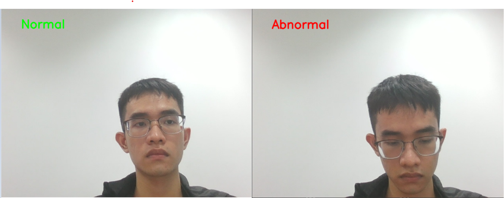
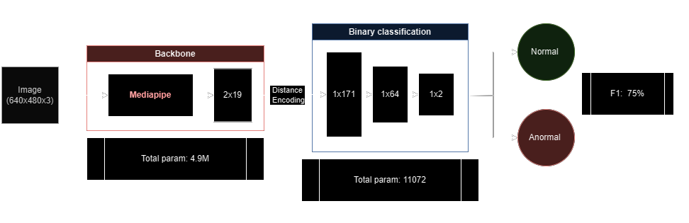
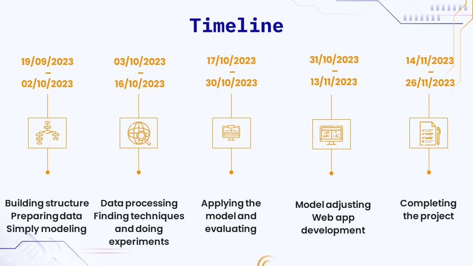

# Exam Abnormal Behavior Recognition



# Introduction
The Final Exam Abnormal Behavior Recognition project is aimed at developing a system that can detect and recognize abnormal behavior during university final exams. The project utilizes computer vision and deep learning techniques to monitor and analyze student behavior to identify any actions that may indicate academic dishonesty or irregularities.
# System Structure


# Data
  - Train: 563
  - Test: 139
  - Size: 640x480

  [>> More information ](Source/Data/README.md)


# Model

  - 
  - 
  
  [>> More information ](Source/Model/README.md)


# Installation
1. Clone the repository.
```sh
   git clone https://github.com/dinhanit/Abnormal_Behavior.git
```
2. Install requirements
 ```
   pip install -r requirements.txt
```
# Usage
- Run on device
  ```bash
  cd Source/Model/onnx
  python testmodel.py
    ```
- Run on FastAPI
  ```bash
  cd Source/Model/onnx
  python FApi.py
    ```
# Custom
- Training
  ```bash
  cd Source/Model
  python Train.py
    ```


# Information Team:
- Data: Le Huy Hoan, Dang Thi Le Chi
- Model: Ngo Dinh An, Ho Ton Bao
- Web: Nguyen Thanh Dat
# Timeline


# Contact
- Email: laptrinhdk23@gmail.com
