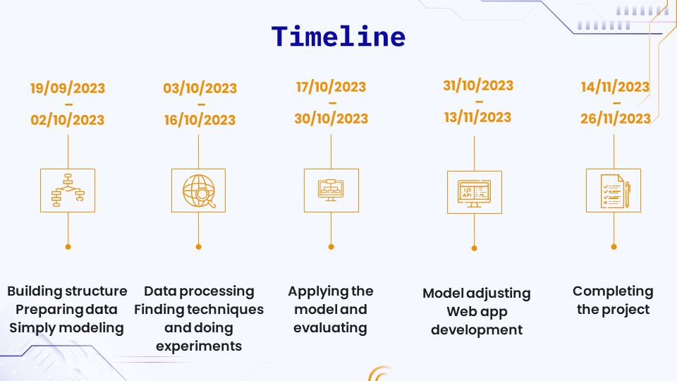

# Exam Abnormal Behavior Recognition

# Introduction
The Final Exam Abnormal Behavior Recognition project is aimed at developing a system that can detect and recognize abnormal behavior during university final exams. The project utilizes computer vision and deep learning techniques to monitor and analyze student behavior to identify any actions that may indicate academic dishonesty or irregularities.
# Evaluate

# System


# Detail
  - Technical:
    - Model: [Beit]('https://arxiv.org/pdf/2106.08254.pdf') (BERT Pre-Training of Image Transformers)
  - Requirements:
    - Python 3.x
    - Camera 

# Installation
1. Clone the repository.
```sh
   git clone https://github.com/dinhanit/Abnormal_Behavior.git
```
2. Install requirements
 ```
   pip install -r requirements.txt
```
# Usage
- Run
  ```bash
    python main.py
    ```
# Custom
- Data
    ```bash
    cd Data/
    ```
    1. Split Data
    ```python
        python SplitData.py
    ```
    2. Processing Data
    ```python
        python ProcessingData.py
    ```

- Model
    ```bash
    cd Model/
    ```
    1. Training
    ```python
        python Train.py
    ```
    2. Test
    ```python
        python Test.py
    ```
- Web
    ```bash
    cd Web/
    ```
    1. Run
    ```code
        python Web.py
    ```
# Information Team:
- Data: Le Huy Hoan, Dang Thi Le Chi
- Model: Ngo Dinh An, Ho Ton Bao
- Web: Nguyen Thanh Dat
# Timeline

# Tree Project
[Click](https://www.mindmeister.com/app/map/2959987752?t=k466Mfuf5F)
# Contact
- Email: laptrinhdk23@gmail.com
