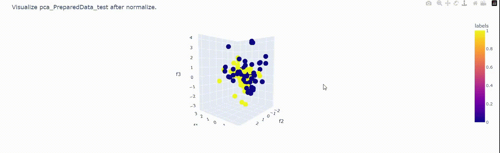

# Exam Abnormal Behavior Recognition (Data Branch).
<p id="top"></p>

<!-- TABLE OF CONTENTS -->
<details>
  <summary>Table of Contents.</summary>
  <ol>
    <li>
      <a href="#about-the-branch">About The Branch.</a>
    </li>
    <li>
      <a href="#getting-started">Getting Started.</a>
      <ul>
        <li><a href="#Pipeline">2.1 Pipeline.</a></li>
        <li><a href="#installation">2.2 Installation.</a></li>
        <li><a href="#instructions_manual">2.3 Instructions Manual.</a></li>
      </ul>
    </li>
    </li>
    <li><a href="#development_history">Development History.</a></li>
    <li>
      <a href="#exploratory_data_analysis_eda">Exploratory Data Analysis (EDA.)</a>
      <ul>
        <li><a href="#dataframe">4.1 Dataframe.</a></li>
        <li><a href="#check_imbalanced">4.2 Check Imbalanced Data.</a></li>
        <li><a href="#kernel_den">4.3 Kernel Density Plots.</a></li>
        <li><a href="#pca">4.4 PCA.</a></li>
        <li><a href="#visual_image">4.5 Visual On Image.</a></li>
      </ul>
    <!-- </li>
    <li><a href="#development_history">Development History.</a></li> -->
  </ol>
</details>


<!-- ABOUT THE PROJECT -->
## 1. About The Branch.
<a id="about-the-branch"></a>

This is an overview of the branch directory.


<p align="right"><a href="#top">Back to Top</a></p>


<!-- GETTING STARTED -->
## 2. Getting Started.
<a id="getting-started"></a>

This is an instructions on setting up project locally.
### 2.1 Pipeline.
<a id="Pipeline"></a>

This is our flow to run this branch.


### 2.2 Installation.
<a id="installation"></a>

Below is all nesscesary packages that need to be installed.

1. Clone the repo.
   ```sh
   git clone https://github.com/dinhanit/Abnormal_Behavior.git
   ```
2. Install the Mediapipe packages .
   ```python
   pip install mediapipe
   ```

### 2.3 Instructions Manual.
<a id="instructions_manual"></a>

1. As above pipeline charts, you need to collect data first. Open folder `DataSets`, run `Collect_Image_2.py`
   ```python
   python Collect_Image_2.py
   ```
   After run that file, we will have images that will be data in `Origin` folder (we have already collected 800 images, namely 400/class). Then, run `SplitData.py`
   ```
   python SplitData.py
   ```
   It will split all images from `Origin` folder to `SplitData` folder (with ratio 8/2, we split 638 images for train set and 162 images for test set).

2. Back to `Data` folder and run `Pre_Data`
   ```sh
   python Pre_Data.py
   ```
   This code will call `Pre_Image.py` (Pre_Image return the landmarks from an image). `Pre_Data.py` will take all images from `SplitData/train` folder and get landmarks from all images, and save them to `Prepared_data_train.csv` files. 
   Then, this files will have 638 rows represent for 638 images in train set. Similarly, `Prepared_data_test.csv` will contain 162 rows for 162 images in test set.

3. Run `EDA_data.ipynb`, return the numpy array data for tranning. 

<p align="right"><a href="#top">Back to Top</a></p>


<!-- CONTRIBUTING -->
## 3. Development History.
<a id="development_history"></a>


<p align="right"><a href="#top">Back to Top</a></p>

<!-- USAGE EXAMPLES -->
## 4. Exploratory Data Analysis (EDA).
<a id="exploratory_data_analysis_eda"></a>

### 4.1 Dataframe.
<a id="dataframe"></a>

+ This is the original dataframe.


+ Anomalies of the data set.


+ Delete abnormal values and save dataframe.


### 4.2 Check imbalanced data.
<a id="check_imbalanced"></a>


### 4.3 Kernel Density Plots to visualize values in data.
<a id="kernel_den"></a> 


<!--  -->


<!--  -->


### 4.4 PCA.
<a id="pca"></a>


+ Histogram for Label in pca_dataframe.


+ Visualize PCA.




### 4.5 Visualize on Image.
<a id="visual_image"></a>

+ Visualize selected keypoints on image.


+ Visual distances between selected keypoints on image.


+ Visualize selected keypoints in 3D.


+ Visualize all keypoints on 3D.


<p align="right"><a href="#top">Back to Top</a></p>


