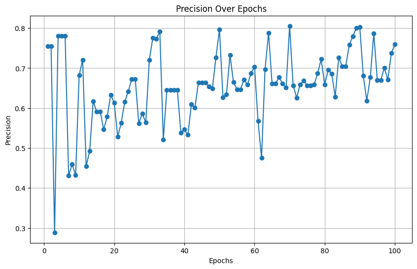

# Exam Abnormal Behavior Recognition (Model Branch).


<!-- ABOUT THE PROJECT -->
## 1. Performance of model: ##

#### The model is evaluated on F1-Score, Loss after 100 epochs and calculates gradient norm to evaluate whether vanishing gradient appears or not. ####

<a id="about-the-branch"></a>
  - ### F1-Score Over Epochs ###
  


  - ### Loss Over Epochs ###
  


  - ### Gradient Over Epochs ###
  


<!-- GETTING STARTED -->
# Instructions. #
<a id="getting-started"></a>

This is a guide for testing models and testing model performance in practice

## 2. Testing.

2.1 Test with camera and video:
   After changing to brand model:
  
  ***First:***
  
  ```bash
  cd Source
  cd model
  ```

  - Test with video
  
    - Pytorch model
      ```sh
        python test.py
        ```
    - Onnx model
      ```sh
        cd onnx
        python testmodel.py
        ```

  - Test with webcam on desktop
    ```sh
    cd Source
    cd model
    python test.py --source 0
    ```
2.2 Actual performance testing:
  - Test with video

    *Notice: When the window pops up, press the "1" button if you think the frame is Abnormal, press the "0" button if you think the frame is Normal. Then the performance results will be displayed.*
  
    ```sh
    python CheckPerformance.py
    ```
  - Examples of results you can see:
  
    


## 2.3 Use FastApi for testing:

  ```sh
  cd onnx
  python FApi.py
  ```

*Notice: Use /dos after link to try POST.*

## 2.2 Tuning.

  The model can be tuned with optimizer type and learning rate with ``Optuna`` framework:

  ```sh
  python Tuning.py
  ```
    
  Best hyperparameters in ``Pram.py``

----------------------------------------------------------------


