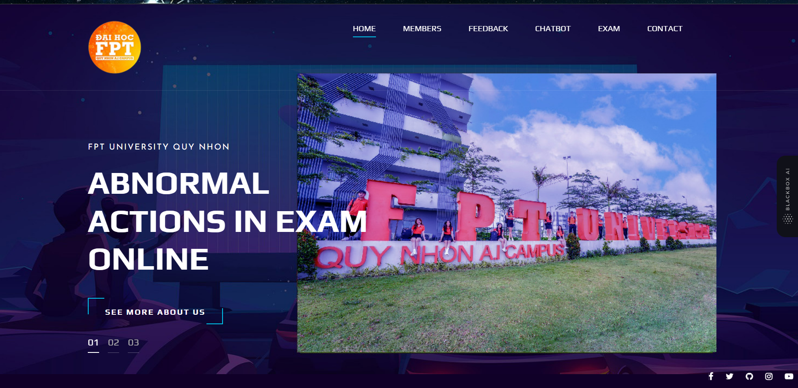
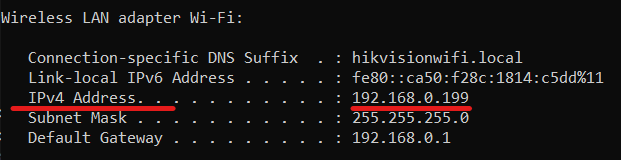
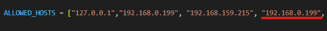

<h1 align="center">GROUP2 WEB APPLICATION</h1>
# Group 2. Welcome to our web application!
[MINDMAP](https://www.mindmeister.com/app/map/2959987752?t=k466Mfuf5F)

<div align=center><div>

## Table of Contents

- [Changelog](#changelog)
- [Install](#install)
- [Usage](#usage)
	- [Get started](#get-start)


## Changelog 
* Nov. 13, 2023: cvpods v0.1 released.

## Install

### Requirements
**Make sure GPU, cuda are available on your local machine.**
* Python ≥ 3.8. Recommended 3.10 on my local
* PyTorch and torchvision that matches the PyTorch installation. You can install them together at pytorch.org to make sure of this
```shell
# Install torch with GPU directly 
pip3 install torch torchvision torchaudio --index-url https://download.pytorch.org/whl/cu118

# Install requirement
pip install -r requirements.txt
```
* OpenSSL is needed to change url from "https" to "https"

## Usage
Use need to creat a model or request to get our model.

### Get Start 
You need to get your ipv4 by:
```shell
ipconfig
```
Then you need to get the ip and come into **setting.py**, put it in ALLOWED_HOSTS:
<div align=center><div>
<div align=center><div>

Run the web:
```shell
#Run web
python manage.py runsslserver --cert abnormal_certificate.crt --key abnormal.key 0.0.0.0:443

#Access the web
https://your_ipv4
```